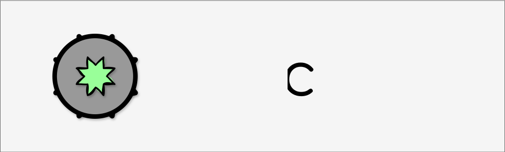

    

 

StacChain is an open-source initiative building the standards and infrastructure to bring **Deep Integrity**, **Provenance**, and **Web3 Economics** to the geospatial ecosystem.

---

## Table of Contents

- [Mission Statement](#mission-statement)
- [Overview](#overview)
- [The Architecture](#the-architecture-the-how)
    - [1. The Data Standard (Deep Integrity)](#1-the-data-standard-deep-integrity)
    - [2. The Engine (SFEOS)](#2-the-engine-sfeos)
    - [3. The Gatekeeper (Verifiable Access)](#3-the-gatekeeper-verifiable-access)
- [Core Repositories](#core-repositories)
- [Use Cases](#use-cases)
- [A Vision for the Future](#a-vision-for-the-future)
- [Dedication to Open Source](#dedication-to-open-source)
- [Community & Contributing](#community--contributing)

---

## Mission Statement

Our mission at **stacchain** is to revolutionize geospatial data management by ensuring data integrity and provenance through blockchain-based verification. We strive to facilitate data discovery and integrate economic incentives for secure data sharing and access. By empowering creative individuals and organizations to publish their work on the blockchain, we aim to enable efficient management, discovery, and monetization of geospatial information in a secure and transparent ecosystem.

## Overview

StacChain is a pioneering platform that aims to bring together the geospatial community into a unified, secure, and efficient ecosystem. By leveraging decentralized ledger technology, StacChain ensures that every piece of geospatial data is immutable and verifiable, providing an unparalleled level of trust and transparency. This verification not only safeguards data integrity but also establishes a clear provenance, allowing users to trace the origin and history of the data they utilize.

### Empowering Innovation and Collaboration
At the heart of StacChain is the belief that accessible and reliable geospatial data can drive innovation and solve real-world problems. By enabling users to publish their work on a transparent ledger, StacChain fosters a collaborative environment where creative individuals and organizations can contribute to and benefit from a rich repository of geospatial information.

### Economic Incentives and Sustainable Growth
StacChain integrates economic incentives into its ecosystem to promote secure data sharing and access. Data providers can monetize their contributions, ensuring that the creation and maintenance of high-quality geospatial data are both recognized and rewarded. This economic model encourages continuous participation and investment from the community, driving the sustainable growth of the platform.

---

## The Architecture (The How)

StacChain is not a single blockchain; it is a suite of interoperable components that connect the standard **STAC (SpatioTemporal Asset Catalog)** specification to the Web3 world.

### 1. The Data Standard: Deep Integrity
We maintain the **STAC Merkle Tree Extension**, a specification that turns any STAC Item into a cryptographically verifiable asset.
* **Deep Hashing:** Binds the `file:checksum` of raw assets (GeoTIFFs) to the item metadata.
* **Aggregation:** Bubbles these hashes up into a **Collection Root**.
* **Result:** If a single pixel changes, the mathematical proof breaks.

### 2. The Engine: SFEOS
We utilize **[SFEOS](https://github.com/stac-utils/stac-fastapi-elasticsearch-opensearch)** (stac-fastapi-elasticsearch-opensearch) as our core engine. It is a high-performance, OGC-compliant STAC API.

StacChain runs as a standard SFEOS instance with our custom **Integrity Extension** enabled, providing:
* **Ingestion:** Middleware that automatically calculates deep integrity hashes and signs items upon upload.
* **Proof Generation:** Dynamic calculation and serving of Merkle Proofs (`GET /proof`) for verification.
* **Anchoring:** Periodic publishing of Collection Roots to a public ledger to freeze the chain of custody.

### 3. The Gatekeeper: Verifiable Access
We are building the **StacChain Gatekeeper**, a standalone microservice that handles Identity and Ownership.
* **Wallet-Based Identity:** Authenticate users via cryptographic signatures rather than passwords.
* **Token-Gated Access:** Check on-chain license balances before granting access to protected S3 buckets.
* **Monetization:** Enable "Pay-per-Request" or "Subscription" models managed by smart contracts.

---

## Core Repositories

| Repo | Status | Description |
| :--- | :--- | :--- |
| **[merkle-tree](https://github.com/stacchain/merkle-tree)** | 🟢 **Stable** | The STAC Extension defining `merkle:root`, `merkle:object_hash`, and Deep Integrity logic. |
| **[stac-api-integrity](https://github.com/stacchain/stac-api-integrity)** | 🟡 **Draft** | The API Extension defining standard endpoints for retrieving cryptographic proofs. |
| **[gatekeeper](https://github.com/stacchain/gatekeeper)** | 🔴 **Planned** | The Auth service for verifiable access control and license checks. |
| **[smart-contracts](https://github.com/stacchain/smart-contracts)** | 🟡 **Alpha** | Solidity contracts for Registry Anchoring and Tokenized Licenses. |

---

## Use Cases

### 🛡️ Deep Integrity & Legal Verification
* **Problem:** How do you prove a satellite image used in court hasn't been photoshopped?
* **Solution:** The **Merkle Proof** links the specific image file to a Root Hash that was anchored on a public ledger *months ago*. The math proves the file existed in that exact state at that time.

### 💰 Tokenized Licenses
* **Problem:** Selling data is hard; usually, you just sell opaque subscriptions.
* **Solution:** Providers can mint "License Tokens" representing usage rights for specific datasets. The Gatekeeper ensures only the wallet holding a valid license can download the high-res GeoTIFF.

### 🙈 Zero-Trust Compute
* **Problem:** Providers don't want to share raw pixels; Users don't trust the provider's math.
* **Solution:** "Compute-to-Data." The provider runs the algorithm locally and returns the result + a **Merkle Proof** showing exactly which signed input files were processed.

---

## A Vision for the Future

Our vision extends beyond building a platform—we aim to help reshape the geospatial landscape by making data more accessible, secure, and valuable for everyone. By uniting data creators and users under a transparent and decentralized framework, StacChain aspires to tackle global challenges with data-driven solutions. We believe that by empowering communities with the right tools and data, we can contribute to a more informed, responsive, and sustainable world.

## Dedication to Open Source

At **stacchain**, we are deeply committed to the principles of open source. We believe that collaboration, transparency, and shared knowledge are the cornerstones of innovation. By open-sourcing our code and promoting open standards, we aim to foster an inclusive community where developers, researchers, and organizations can work together to enhance the platform and its capabilities.

## Community & Contributing

We welcome contributions of all kinds to the StacChain organization. Whether you're interested in coding, documentation, research, community building, or any other area, there are many ways to get involved.

* **Core Contributors:** _Project Lead_ ([**Jonathan Healy**](https://github.com/jonhealy1))
* **Discussions:** [Join the conversation](https://github.com/orgs/stacchain/discussions)

**Ways to Contribute:**
* **Contribute to Projects:** Explore our GitHub repositories and contribute to existing projects.
* **Improve Documentation:** Help us enhance our documentation by identifying gaps or writing tutorials.
* **Report Issues:** If you encounter any issues, please open an issue in the relevant repository.

*Built with ❤️ for the Open Metaverse.*
